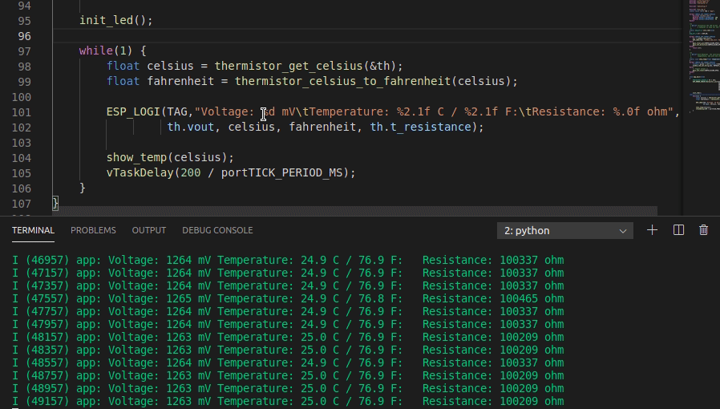

# ESP32 Thermistor Example

This is an example of using the component [esp32-thermistor](https://github.com/jjsch-dev/esp32-thermistor/tree/master/components/esp32-thermistor) to measure the temperature using a [thermistor](https://www.murata.com/~/media/Webrenewal/Support/library/catalog/products/thermistor/ntc/r44e.ashx?la=en-us) connected to an ADC channel of ESP32-C3.


Although the implementation has been demonstrated with the Murata NXRT15WF104FA1B, knowing the beta coefficient published by the manufacturer, any other available on the market can be used, an example could be those that use [3D printers](https://reprap.org/wiki/Thermistor) for the bed or the hot-end.

## Circuit

The thermistor is part of a resistive divider, where one of its ends is connected to GND and the other to the digital analog channel of ESP32-C3 plus the series resistor whose end is connected to 3.3 V.


It is important to bear in mind that the resistance of the series has to have a tolerance of 1% or better, and if the footprint allows the dissipated power to be better than an order of magnitude of the maximum current that crosses it so that the stability is high.

Espressif [recomend](https://docs.espressif.com/projects/esp-idf/en/latest/esp32/api-reference/peripherals/adc.html) a 0.1uF capacitor to the ADC input to minimize noise.


## Prototype 

This component is the thermostat of an IOT project of the ceiling fan, so I started testing it on the next development board.


## Behavior analysis

To evaluate the performance of a thermistor that is connected to an analog digital converter, (in addition to the quality and precision of it), many things can alter the result, for example the stability of the power source, the Ripple of VDD 3.3V , the resolution of the series resistance, but especially the linearity of the ADC converter that has implemented Espressif in ESP32.
I must say that the quality of the ESP32-C3 has surprised me, after using the characterization function of the ADC, the mV measurement is extremely accurate for a processor of this price. 

In the following images you can compare the measurement made with the oscilloscope at the analog channel input of the ESP32-C3 and the monitor output where the measured thermistor temperature is logged, as you can see the difference is a few mV.


AC noise with wifi / bluetooth off is better than 15mV.


## Brief description of the API
To use the component, you need to get the handle of the instance `thermistor_handle_t` with the function` thermistor_init`, which takes as parameters the series resistance, the nominal resistance of the thermistor, the adc channel, the voltage of the source and the nominal temperature of thermistor.

To get the temperature in degrees Celsius, you must call the `thermistor_get_celsius` function that returns a float, and to convert it to Fahrenheit you can use the` thermistor_celsius_to_fahrenheit` function that also returns a float.

Note: if you use the example application you can configure this parameters with the `idf.py menuconfig`.

Usage Example
----------------
```c

    thermistor_handle_t th = {0};
    ESP_ERROR_CHECK(thermistor_init(&th, ADC_CHANNEL_2, 
                                    CONFIG_SERIE_RESISTANCE, 
                                    CONFIG_NOMINAL_RESISTANCE, 
                                    CONFIG_NOMINAL_TEMPERATURE,
                                    CONFIG_BETA_VALUE, 
                                    CONFIG_VOLTAGE_SOURCE));
    while (1) {
        float celsius = thermistor_get_celsius(&th);
        float fahrenheit = thermistor_celsius_to_fahrenheit(celsius);

        ESP_LOGI(TAG,"Voltage: %d mV\tTemperature: %2.1f C / %2.1f F:\tResistance: %.0f ohm", 
                 th.vout, celsius, fahrenheit, th.t_resistance);

        show_temp(celsius);
        vTaskDelay(200 / portTICK_PERIOD_MS);
    }
```
## Operation video
The following section shows the operation of the App thermistor. The video shows the temperature logged on the monitor in degrees Celsius and Fahrenheith along with the divider voltage and the calculated resistance of the thermistor. It also displays the voltage read on an oscilloscope and tester for comparison.


The video shows the temperature recorded on the monitor in degrees Celsius and Fahrenheith when the thermistor is heated by hand.




